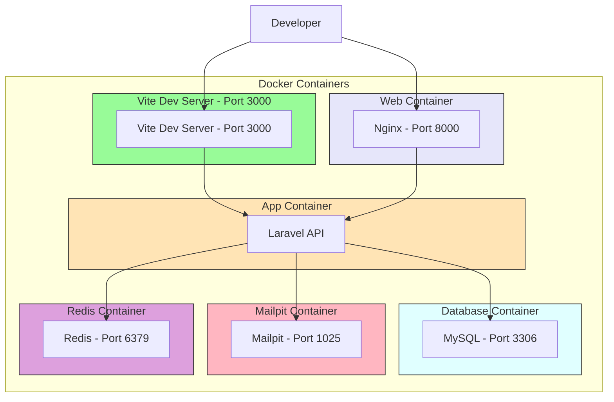

```mermaid
graph TD
    A[Developer] --> B[Vite Dev Server - Port 3000]
    A --> C[Nginx - Port 8000]
    B --> D[Laravel API]
    C --> D
    D --> E[MySQL - Port 3306]
    D --> F[Redis - Port 6379]
    D --> G[Mailpit - Port 1025]
    
    subgraph Docker Containers
        subgraph AppContainer [App Container]
            D
        end
        
        subgraph WebContainer [Web Container]
            C
        end
        
        subgraph DbContainer [Database Container]
            E
        end
        
        subgraph MailContainer [Mailpit Container]
            G
        end
        
        subgraph RedisContainer [Redis Container]
            F
        end
        
        subgraph ViteContainer [Vite Dev Server - Port 3000]
            B
        end
    end
    
    style AppContainer fill:#FFE4B5,stroke:#333
    style WebContainer fill:#E6E6FA,stroke:#333
    style DbContainer fill:#E0FFFF,stroke:#333
    style MailContainer fill:#FFB6C1,stroke:#333
    style RedisContainer fill:#DDA0DD,stroke:#333
    style ViteContainer fill:#98FB98,stroke:#333
```